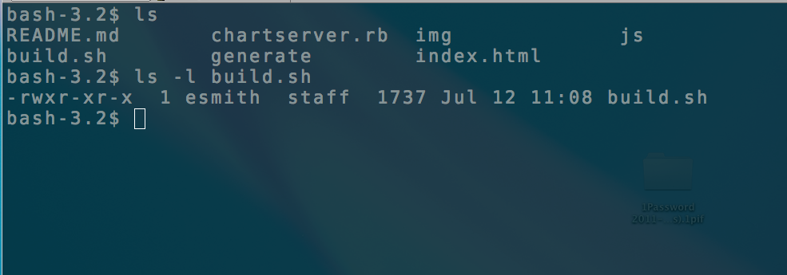

# shellcraft

!SLIDE

# Shellcraft
## building a better command line

### (an apology for Unix)

### [@erichs](http://github.com/erichs)/GitHub

!NOTES
 So, I think youre not supposed to start out a presentation with an apology, but Im going to anyway... this talk is an apology for Unix.
 I mean that both in the sense of expressing regret, and in the sense of defending or justifying.

 A lot of folks, and I definitely include myself here, pretty regularly fall victim to some negative cultural assumptions and technical anti-patterns in the Unix shell.
 I wanted to highlight a few of those issues, and take a look at some methods I've found to address them.

 This talk is going to delve into some technical areas, but I won't assume you
 have much prior experience with Unix.  Many of the ideas presented here may be
 more generally applicable, and if they don't directly apply to your situation,
 my hope is that they will serve as food for thought.

!SLIDE left

## what do you mean, shell?

### servant of two masters

* CLI - command interpreter, exposes operating system
* script interpreter - programming interface, batches commands

!SLIDE left

## Unix shell is famously difficult to master...

* steep learning curve
* arcane, terse commands
* not user friendly

> Unix never says 'please'.
>
> -- Rob Pike

!SLIDE

## yet, it's often the most powerful tool.

### Gary Bernhardt - The Unix chainsaw
Unix hasnt killed anyone. Yet.

!NOTES
'

!SLIDE left
## The Unix philosophy:

> Write programs that do one thing and do it well.
>
> Write programs to work together.
>
> Write programs to handle text streams, because that is a universal interface.
>
> &nbsp;
>
> -- Doug McIlroy, the inventor of Unix pipes (1972)

!SLIDE left
## pipes - Unix's killer app

!SLIDE left
## example: what's my MAC address?

@@@ shell
$ ifconfig eth0

eth0      Link encap:Ethernet  HWaddr f8:1e:df:e6:a9:13
          inet addr:10.80.100.35  Bcast:10.80.100.255  Mask:255.255.0.0
          inet6 addr: fe80::20b:dbff:fe93:a08/64 Scope:Link
          UP BROADCAST RUNNING MULTICAST  MTU:1500  Metric:1
          RX packets:408752002 errors:0 dropped:0 overruns:0 frame:0
          TX packets:388745488 errors:0 dropped:0 overruns:0 carrier:0
          collisions:0 txqueuelen:1000
          RX bytes:123203059 (123.2 MB)  TX bytes:2194999939 (2.1 GB)
          Interrupt:16
@@@

!SLIDE left
## example: what's my MAC address?

@@@ shell
  $ ifconfig eth0 | grep HWaddr

eth0      Link encap:Ethernet  HWaddr f8:1e:df:e6:a9:13
@@@

'grep' shows only lines that contain some matching expression.

!SLIDE left
## example: what's my MAC address?

@@@ shell
  $ ifconfig eth0 | grep HWaddr | awk '{print $NF}'

  f8:1e:df:e6:a9:13
@@@

'awk' is grep on steroids.

!SLIDE left
## example: what's my MAC address?

@@@ shell
  $ ifconfig eth0 | grep HWaddr | awk '{print $NF}' | tr '[:lower:]' '[:upper:]'

  F8:1E:DF:E6:A9:13
@@@

'tr' _translates_ one set of characters to another.

!SLIDE
## demo: mac address

!SLIDE left
## strengths of the Unix model

@@@ shell
  $ ifconfig eth0 | grep HWaddr | awk '{print $NF}' | tr '[:lower:]' '[:upper:]'
@@@

### strengths

* easy to assemble
* infinitely flexible
* easy to reason about

!SLIDE left
## strengths are also weaknesses

@@@ shell
  $ ifconfig eth0 | grep HWaddr | awk '{print $NF}' | tr '[:lower:]' '[:upper:]'
@@@

<table style='width: 100%'>
<tr>
<td>

<h3>strength</h3>
<ul>
<li>easy to assemble</li>
<li>infinitely flexible</li>
<li>easy to reason about</li>
</ul>

</td>
<td width="200px">&nbsp;</td>
<td>

<h3>weakness</h3>
<ul>
<li class="slide">hard to read</li>
<li class="slide">some assembly is always required</li>
<li class="slide">transformations are opaque</li>
</ul>

</td>
</tr>
</table>

!SLIDE left
## fixating on weakness becomes limitation

@@@ shell
  $ ifconfig eth0 | grep HWaddr | awk '{print $NF}' | tr '[:lower:]' '[:upper:]'
@@@

<table style='width: 100%'>
<tr>
<td>

<h3>weakness</h3>
<ul>
<li>hard to read</li>
<li>some assembly is always required</li>
<li>transformations are opaque</li>
</ul>

</td>
<td width="200px">&nbsp;</td>
<td>

<h3>limiting belief</h3>
<ul>
<li class="slide">shell scripts are ugly</li>
<li class="slide">Unix shell isn't REAL programming</li>
<li class="slide">good for throw-away code</li>
</ul>

</td>
</tr>
</table>

!SLIDE left
## changing POV

Bernhardt's talk inspired me to revisit my approach to using the shell.

&nbsp;

Insight:
### statements freeze perspectives, questions open them up.

!SLIDE
## jedi mind trick: inverting limits

### invert a limiting belief, and turn it into an open-ended question

!SLIDE left
## inverting limits

@@@ shell
  $ ifconfig eth0 | grep HWaddr | awk '{print $NF}' | tr '[:lower:]' '[:upper:]'
@@@

<table style='width: 100%'>
<tr>
<td>

<h3>limiting belief</h3>
<ul>
<li>shell scripts are ugly</li>
<li>Unix shell isn't REAL programming</li>
<li>good for throw-away code</li>
</ul>

</td>
<td width="200px">&nbsp;</td>
<td>

<h3>empowering question</h3>
<ul>
<li class="slide">what would beautiful shell look like?</li>
<li class="slide">what if it were easier to apply modern coding practices?</li>
<li class="slide">what if shell programs  were always available for refactoring?</li>
</ul>

</td>
</tr>
</table>

!SLIDE left
## empowering question

**what would beautiful shell look like?**

* readable
* understandable
* documented

!NOTES
readability includes things like whitespace/aesthetics (Python gets this right to a fault), narrative flow, method length and style

understandability includes things like comprehension, intention-revealing names, method length, kiss principle. measured in WTFs/m.

documentation covers intention-revealing names, comments & inline documentation, version control comments and history (metadata), and externally generated doc (Doxygen, javadoc)

!SLIDE left
## composed method

striving for **readable**, **understandable** code often results in many small, well-named methods.

-what Kent Beck refers to as the _Composed Method_ pattern

!SLIDE left
&nbsp;
## apply composed method

### before
@@@ shell
  $ ifconfig eth0 | grep HWaddr | awk '{print $NF}' | tr '[:lower:]' '[:upper:]'
@@@

### after
@@@ shell
  get_mac_address () {
    ifconfig $1 | grep HWaddr | lastcol | uppercase
  }

  lastcol () {
    awk '{ print $NF }'
  }

  uppercase () {
    tr '[:lower:]' '[:upper:]'
  }

  $ get_mac_address eth0

  F8:1E:DF:E6:A9:13
@@@

!SLIDE left
## composed method

@@@ shell
  get_mac_address () {
    ifconfig $1 | grep HWaddr | lastcol | uppercase
  }

  lastcol () {
    awk '{ print $NF }'
  }

  uppercase () {
    tr '[:lower:]' '[:upper:]'
  }
@@@

### benefits

* uses intention-revealing names
* drops clues regarding data transformations
* promotes code reuse

!SLIDE left
## reality check
### why aren't all shell commands composed in this style?

&nbsp;

tensions between _interactive_ CLI and _batch_ script interpreter:

* feedback- REPL prints intermediate results that scripts lack
* editing context- prompt (1D) vs text editor (2D)

!SLIDE left
## two environments, two adaptations

* interactive CLI is the native habitat for building up pipelines

* non-interactive script files are the native habitat for shell functions

&nbsp;

### can we have the best of both worlds?

!SLIDE left
## empowering question, revised

**what if it were easier to  ^ interactively <strike>apply modern coding practices</strike> compose shell functions?**

### blur the lines between prompt and script

!SLIDE left
## draft functions from command line

@@@ shell
$ ifconfig eth0 | grep HWaddr |  awk '{ print $NF }'

00:0b:db:93:0a:08

$ draft get_mac_address

$ get_mac_address

00:0b:db:93:0a:08
@@@

!SLIDE left
## revise functions from command line

@@@ shell
$ revise get_mac_address
@@@

### opens definition in text editor

@@@ shell
get_mac_address ()
{
  ifconfig $1 | grep HWaddr |  awk '{ print $NF }'
}
@@@

### re-loads function into memory on save

@@@ shell
$ get_mac_address eth0

00:0b:db:93:0a:08
@@@

!SLIDE left
## demo: draft / revise

### use draft() and revise() for **interactive-style function composition** from the prompt

!SLIDE left
## empowering question

**what if shell programs were always available for refactoring?**

* never throw code away
* automatic, transparent versioning
* quickly re-open functions for revision

!SLIDE left
## local Git repository

### draft() and revise() auto-commit with local Git repo

* function persistence across shell sessions
* revisions available via normal git commands
* share functions with team via shared repo access

!SLIDE left
## empowering question

**what would beautiful shell look like?**

* readable
* understandable
* **documented???**

!SLIDE left
## towards better documentation

Comments are helpful. Shell scripts allow them, but in-memory functions don't.

@@@ shell
  $ foo () {
      # this is a comment
      echo 'foo'
  }

  $ typeset -f foo

  foo () {
      echo 'foo'
  }
@@@

!NOTES
you could argue that storing comments in loaded shell functions is meaningless, but it turns out to be a worthwhile endeavor.
'

!SLIDE left
## towards better documentation
### A sneaky shell comment would:

* be a valid shell statement
* allow arbitrary text as arguments
* have zero side effects

!SLIDE left
## null command, :

> Since the values passed on the command line of the null command are ignored, the null command can be used as a comment.

@@@ shell
  : This is a comment
@@@

> However, there is no advantage to using this--it is more of a novelty than a practical technique.
>
> &nbsp;
>
> Blinn, 205

!SLIDE left
## a personal challenge

@@@ shell
REM () {
    :
}

foo () {
    REM 'a BASIC remark'
    echo 'foo'
}

$ typeset -f foo

foo () {
    REM 'a BASIC remark'
    echo 'foo'
}
@@@

!SLIDE left
## more than a comment

@@@ shell
REM () {
    :
}
@@@

### features

* function names are arbitrary
* create as many as you need
* simplest possible shell function
* retrievable at run-time

!SLIDE left
## run-time introspection

@@@ shell
$ typeset -f foo

foo () {
    REM 'a BASIC remark'
    echo 'foo'
}

$ typeset -f foo | grep REM | lastcol

'a BASIC remark'
@@@

### key idea: code is also data

!SLIDE
## functional metadata

### key/value metadata for shell functions!

!NOTES
 One side-effect of using functional metadata is that you can intentionally override those functions to produce side-effects:
logging, debug print statments, keeping statistics, copying files, whatever, without modifying your existing code.

!SLIDE left
## establish keyword convention

@@@ shell
# cite() magically builds metadata functions

cite about author example group param version
@@@

!SLIDE left
## get_mac_address, reprised

@@@ shell
 get_mac_address () {
    about 'retrieves mac address for a given network interface'
    param '1: network interface'
    example '$ get_mac_address eth0'
    group 'network'

    ifconfig $1 | grep HWaddr | lastcol | uppercase
  }
@@@

!SLIDE left
## get_mac_address, reprised

@@@ shell
  lastcol () {
   about 'prints the last column of space-delimited text data'
   example '$ echo "1 2 3" | lastcol   # prints "3"'
   group 'filters'

   awk '{ print $NF }'
  }
@@@

!SLIDE left
## get_mac_address, reprised

@@@ shell
  uppercase () {
    about 'converts lowercase characters to uppercase'
    example '$ echo "abc" | uppercase   # prints "ABC"'
    group 'filters'

    tr '[:lower:]' '[:upper:]'
  }
@@@

!SLIDE left
## putting metadata to work

@@@ shell
$ reference get_mac_address

get_mac_address     retrieves mac address for a given network interface
parameters:
                    1: network interface
examples:
                    $ get_mac_address eth0
@@@

### use case: api reference

!SLIDE left
## putting metadata to work

@@@ shell
$ glossary filters

lastcol             prints the last column of space-delimited text data
uppercase           converts lowercase characters to uppercase
@@@

### use case: list commands by group

!SLIDE left
## putting metadata to work

@@@ shell
$ all_groups

filters
network
@@@

### use case: list available groups

!SLIDE left
## persist shell functions with metadata

@@@ shell
$ write get_mac_address lastcol uppercase > getmac.sh
$ echo "get_mac_address $1" >> getmac.sh
$ sh ./getmac.sh eth0

F8:1E:DF:E6:A9:13
@@@

!SLIDE
## demo: composure

### simple network monitor

!SLIDE left
## links

### blogs
[Gary Bernhardt](http://destroyallsoftware.com)

[Kent Beck](http://www.threeriversinstitute.org/blog/)

[Martin Fowler](http://martinfowler.com/)

### reference
[The Unix Chainsaw (31 minutes)](http://www.confreaks.com/videos/615-cascadiaruby2011-the-unix-chainsaw)

[Blinn, Bruce. _Portable Shell Programming_. New Jersey: Prentice Hall, 1996.](http://amzn.com/0134514947)

### tools
[erichs/composure](https://github.com/erichs/composure)

[shocco - literate shell documentation](http://rtomayko.github.com/shocco/)
